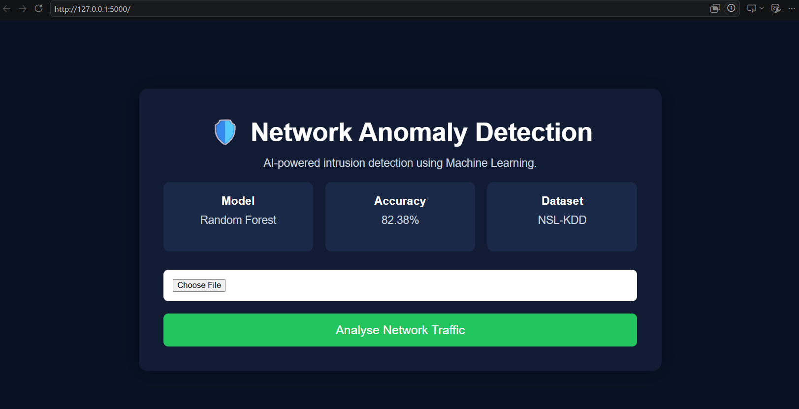
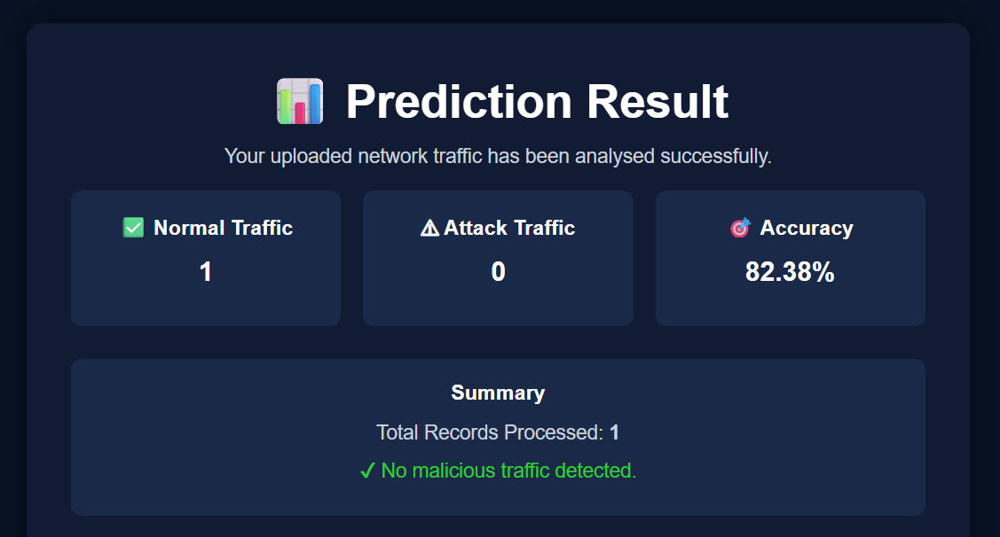

# 🛡️ Network Anomaly Detection Using Machine Learning

## 📌 Project Overview

This project is a Flask-based web application that detects malicious network traffic using Machine Learning. The application analyses uploaded network traffic data and classifies it as either **Normal** or **Attack** using a trained Random Forest model.

The model is trained on the **NSL-KDD** dataset and provides an easy-to-use web interface for analysing network traffic.

---

## 🚀 Features

- Upload network traffic data (CSV/TXT)
- Detect normal and malicious traffic
- Machine Learning-based prediction
- Random Forest Classification
- Pie chart visualisation of prediction results
- User-friendly Flask web interface
- Dark themed responsive UI

---

## 🛠️ Technologies Used

- Python
- Flask
- Pandas
- NumPy
- Scikit-learn
- Matplotlib
- HTML
- CSS
- JavaScript

---

## 📂 Dataset

- NSL-KDD Dataset
- Training Dataset: `KDDTrain+.txt`
- Testing Dataset: `KDDTest+.txt`

---

## 🤖 Machine Learning Model

**Algorithm:** Random Forest Classifier

**Accuracy:** **82.38%**

---

## 📁 Project Structure

```text
Network-Anomaly-Detection/
│
├── dataset/
├── models/
├── screenshots/
│   ├── home.png
│   └── result.png
├── static/
├── templates/
│
├── app.py
├── preprocess.py
├── train_model.py
├── predict.py
├── requirements.txt
├── sample_test.csv
└── README.md
```

---

## ⚙️ Installation

### Clone the repository

```bash
git clone https://github.com/Zubeda-24/Network-Anomaly-Detection.git
```

### Go to the project folder

```bash
cd Network-Anomaly-Detection
```

### Install dependencies

```bash
pip install -r requirements.txt
```

### Run the application

```bash
python app.py
```

### Open in browser

```
http://127.0.0.1:5000
```

---

## 📊 Workflow

1. Upload a network traffic file.
2. The application preprocesses the data.
3. The Random Forest model predicts the traffic type.
4. Results are displayed with a summary and pie chart.

---

# 📸 Screenshots

## 🏠 Home Page



---

## 📊 Prediction Result



---

## 🔮 Future Improvements

- Add Bar Chart Visualisation
- Feature Importance Graph
- Download Prediction Report
- Real-time Network Monitoring
- Deep Learning-based Detection

---

## 👩‍💻 Author

**Kandukuri Zubeda**

GitHub: https://github.com/Zubeda-24